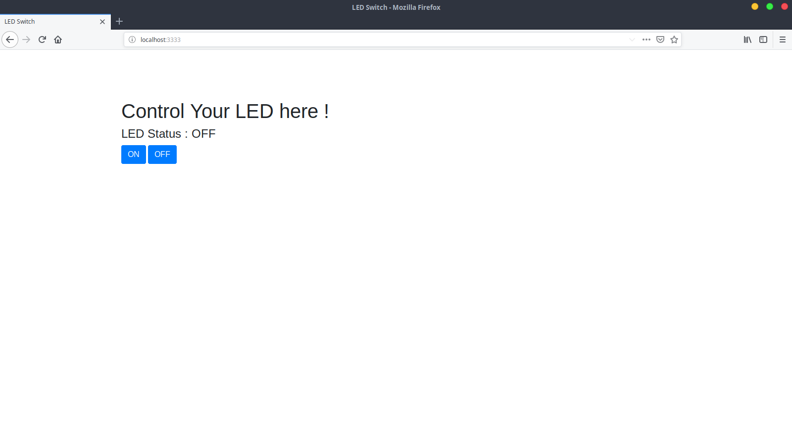

# GPIO LED Switch

## Control LED using Raspberry Pi 3 Model B built in GPIO.

* Using : [onoff](https://www.npmjs.com/package/onoff"), [Express JS](https://www.npmjs.com/package/express)

Preview : 


* Usage :

1. Rename `.env.default` to `.env`

2. Install dependencies :

```javascript
npm i
```

3. Start express server :

```javascript
node server.js
```

Check console log for port and host or simply check `.env` file.
